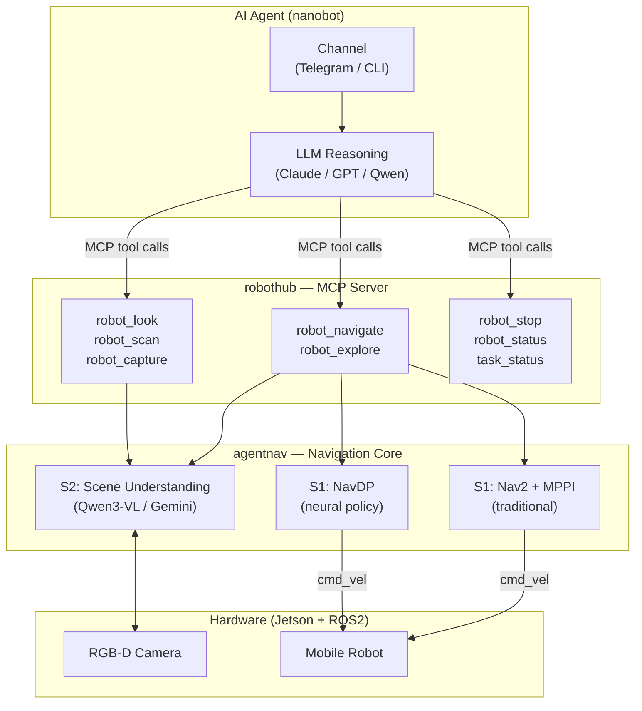

# AgentNav

<p>
  
  
  
  
</p>

**AgentNav** is an open-source framework for agentic robot navigation — let an AI agent drive your robot with natural language.

Instead of issuing a single `navigate("go to chair")` call and hoping for the best, AgentNav exposes navigation as a set of independent tools that an AI agent (via MCP) can reason over: *look*, *navigate*, *scan*, *stop*, *status*. The agent decides when to perceive, when to move, when to retry, and when to give up — just like a human operator would.

```
User: "去黑色椅子"

Agent: robot_look(focus="black chair")
       → "I see a black chair at 2 o'clock, ~2m away"

       robot_navigate("Go to the black chair") → task_id=a1b2

       task_status("a1b2") → {phase: "moving", distance: 0.8m}
       task_status("a1b2") → {phase: "arrived"}

       robot_look() → "I'm standing next to the black chair" ✓
```

---

## Why Agentic Navigation

Traditional navigation stacks are black boxes: one call in, success/failure out. The agent has no visibility into what's happening and no ability to intervene.

AgentNav flips this. Navigation becomes a conversation between the agent and the robot:

| Traditional | AgentNav |
|-------------|----------|
| `navigate(target)` → success/fail | Agent perceives → decides → monitors → recovers |
| Agent blind to progress | Agent polls phase, distance, S2 interpretation |
| Failure = retry blindly | Failure = agent re-reads scene, replans |
| Target must be predefined | Natural language + live camera |

---

## Architecture

```
┌─────────────────────────────────────┐
│  AI Agent (LLM + nanobot / any MCP) │
│  Telegram / Slack / CLI             │
├─────────────────────────────────────┤
│  MCP Tool Layer (robothub)          │
│  robot_look · robot_navigate        │
│  robot_scan · robot_stop · status   │
├─────────────────────────────────────┤
│  Navigation Core (agentnav)         │
│  S2: Vision-Language Understanding  │  ← Qwen3-VL (local) or Gemini (cloud)
│  S1: Motion Execution               │  ← NavDP (neural) or Nav2/MPPI (traditional)
├─────────────────────────────────────┤
│  Hardware: ROS2 / Jetson            │
│  RGB-D Camera · /cmd_vel · /odom    │
└─────────────────────────────────────┘
```



### S2 — Scene Understanding

| Provider | Hardware | Notes |
|----------|----------|-------|
| Qwen3-VL | GPU (≥16GB VRAM) | Local inference, best accuracy |
| Gemini API | None (cloud) | No GPU needed, internet required |

### S1 — Navigation Execution

| Mode | Algorithm | When to use |
|------|-----------|-------------|
| NavDP (default) | Neural diffusion policy | Unstructured environments, no map needed |
| Nav2 / MPPI | Traditional planner | Mapped environments, predictable paths |

---

## MCP Tool Reference

The agent controls the robot through these tools:

| Tool | Description |
|------|-------------|
| `robot_look(focus?)` | Describe current scene via S2. Pass a focus target to check visibility. |
| `robot_scan(angles?)` | Rotate to multiple angles (default 0/90/180/270°), describe each direction. |
| `robot_capture()` | Return raw camera frame as base64. |
| `robot_navigate(instruction)` | Natural language → S2 pose → S1 execution. Returns `task_id`. |
| `robot_explore(hint?)` | Actively search for a target not currently visible. Returns `task_id`. |
| `robot_stop()` | Emergency stop. Latency < 50ms. |
| `robot_status()` | Current pose, velocity, battery, nav state. |
| `task_status(task_id)` | Poll navigate/explore progress: phase, distance, elapsed, S2 interpretation. |
| `task_cancel(task_id)` | Cancel task and stop robot. |

---

## Agent Navigation Patterns

### A — Target visible, navigate directly

```
robot_look(focus="black chair") → visible at 2m
robot_navigate("Go to the black chair") → task_id
[poll task_status every 5s until arrived]
robot_look() → confirm arrival
```

### B — Target not visible, scan then navigate

```
robot_look() → target not visible
robot_scan() → "180°: door leading to corridor"
robot_navigate("Go through the door") → task_id
[arrived] → robot_look(focus="kitchen") → found
robot_navigate("Move to kitchen center") → task_id
```

### C — Navigation failed, agent replans

```
task_status(id) → {status: "failed", reason: "S2 could not locate target"}
robot_look() → "chair partially behind table, only leg visible"
robot_navigate("Go to the chair leg visible behind the table") → task_id
[arrived] ✓
```

### D — Emergency stop

```
User: "停"
Agent: robot_stop() → "Robot stopped."
```

---

## Project Structure

```
AgentNav/
├── nanobot/                 ← Agent OS (MCP client, Telegram/Slack/CLI channels)
│   ├── agent/               ← LLM loop, memory, skills, subagents
│   ├── channels/            ← Telegram, Slack, Discord, WeChat, Email ...
│   ├── providers/           ← LiteLLM, Azure OpenAI, Codex ...
│   └── tools/               ← filesystem, shell, web, MCP, cron
│
├── robothub/                ← MCP server (runs on Jetson, Python 3.10)
│   ├── bridge_core/         ← RobotState, TaskManager, MCP server entry
│   └── drivers/             ← look, navigate, stop, status, task (hot-reloadable)
│
└── agentnav/                ← Navigation core (S2 + S1, 0 lines modified)
    ├── server/              ← S2 HTTP server (Qwen3-VL / Gemini)
    ├── clients/             ← NavDP client, Nav2 client
    ├── core/                ← AgentNavPipeline
    └── robot/               ← ROS2 node, MPC/PID controllers
```

---

## Quick Start

### 1. Start S2 server (GPU machine or cloud)

```bash
# Local Qwen3-VL
conda activate qwen3vl
python -m agentnav.server.s2_server \
    --provider qwen \
    --model_path /path/to/Qwen3-VL-8B-Instruct \
    --port 8890

# OR: Gemini API (no GPU)
python -m agentnav.server.s2_server \
    --provider gemini \
    --gemini_api_key $GEMINI_API_KEY \
    --port 8890
```

### 2. Start robot agent (Jetson)

```bash
conda activate navdp
export S2_HOST=192.168.1.100
export ANTHROPIC_API_KEY=...
export TELEGRAM_BOT_TOKEN=...

python -m nanobot --config robothub/config/nanobot.yaml
```

### 3. Talk to your robot

Send a message on Telegram:

```
你: 去黑色椅子
Bot: 🔍 Looking at the scene...
     I can see a black chair at roughly 2 o'clock, about 2 meters away.
     Navigating... [task a1b2]
     Moving (0.9m remaining)...
     Arrived. ✓
```

---

## Installation

### S2 Server

```bash
conda create -n qwen3vl python=3.10
conda activate qwen3vl
pip install -r requirements_server.txt

# Optional: Flash Attention (faster)
pip install flash-attn --no-build-isolation

# Download Qwen3-VL weights
huggingface-cli download Qwen/Qwen3-VL-8B-Instruct --local-dir /path/to/weights
```

### Jetson Edge (NavDP)

```bash
conda create -n navdp python=3.10
conda activate navdp

# Clone NavDP as sibling of AgentNav
git clone https://github.com/InternRobotics/NavDP ../NavDP
pip install -r requirements_jetson.txt
pip install -e .

sudo apt install ros-humble-cv-bridge ros-humble-message-filters
```

### Jetson Edge (Nav2/MPPI)

```bash
sudo apt install ros-humble-nav2-bringup ros-humble-nav2-msgs \
                 ros-humble-tf2-geometry-msgs ros-humble-slam-toolbox
```

---

## Roadmap

- [x] End-to-end language-to-navigation on real hardware
- [x] NavDP (neural) and Nav2/MPPI (traditional) S1 backends
- [x] Qwen3-VL (local) and Gemini (cloud) S2 backends
- [x] MCP tool layer for agentic control (robothub)
- [x] nanobot agent OS integration (Telegram / CLI)
- [ ] `robot_scan` multi-angle perception
- [ ] `robot_explore` active target search
- [ ] Closed-loop failure recovery (agent replans on task_status failed)
- [ ] Progress streaming to Telegram during navigation
- [ ] Simulation environment for development and evaluation
- [ ] Broader robot platform support

---

## Acknowledgements

- [QwenLM/Qwen3-VL](https://github.com/QwenLM/Qwen3-VL) — S2 vision-language model
- [InternRobotics/NavDP](https://github.com/InternRobotics/NavDP) — S1 neural navigation policy
- [Google Gemini API](https://aistudio.google.com/) — S2 cloud provider
- [Nav2](https://nav2.ros.org/) — S1 traditional navigation stack

---

## Contributing

Contributions welcome in:

- New S1 navigation backends (VLN policies, other planners)
- New S2 vision-language providers
- ROS2 integration and new robot platforms
- Simulation environments
- Benchmarking and evaluation tools

Issues, PRs, and Discussions are open.
