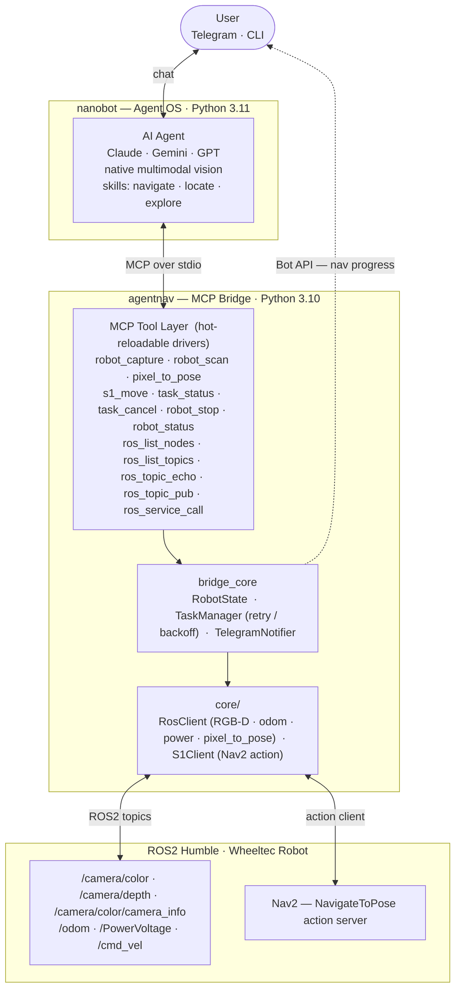

# AgentNav

<p>
  
  
  
  
</p>

**AgentNav** is an open-source framework for agentic robot navigation — let an AI agent drive your robot with natural language.

Instead of issuing a single `navigate("go to chair")` call and hoping for the best, AgentNav exposes navigation as a set of independent, single-purpose tools that a multimodal AI agent (via MCP) can reason over. The agent perceives the scene with its own vision, plans the move, executes, monitors progress, and recovers from failures — all through tool calls.

```
User: "Go to the black chair"

Agent: robot_capture()
       → [sees black chair at 2 o'clock, ~2m away]

       pixel_to_pose(u=380, v=290) → {x: 1.8, y: 0.3, theta: 0.1}
       s1_move({x: 1.8, y: 0.3, theta: 0.1}) → task_id=a1b2

       task_status("a1b2") → {phase: "moving", distance: 0.8m}
       task_status("a1b2") → {phase: "arrived"}

       robot_capture() → [confirmed standing next to the black chair] ✓
```

---

## Why Agentic Navigation

Traditional navigation stacks are black boxes: one call in, success/failure out. The agent has no visibility into what's happening and no ability to intervene.

AgentNav flips this. Navigation becomes a conversation between the agent and the robot:

| Traditional | AgentNav |
|-------------|----------|
| `navigate(target)` → success/fail | Agent perceives → locates → executes → monitors → recovers |
| Requires separate VLM service | Agent's own vision (Claude/Gemini native multimodal) |
| Agent blind to progress | Agent polls phase, distance, interpretation |
| Failure = retry blindly | Agent replans with better description on failure |
| Target must be predefined | Natural language + live camera frame |

---

## Architecture



**Key design principle**: The agent is the brain. Tools are single-purpose and contain no chained logic. Complex behaviours (scan → locate → move, explore, recover) are taught to the agent via **skills** — markdown files the agent reads, not hardcoded pipelines.

---

## MCP Tool Reference

### Perception Tools

| Tool | Description |
|------|-------------|
| `robot_capture()` | Return current camera frame as **ImageContent** — the agent perceives it directly with native vision. Use before navigating and after arriving to confirm. |
| `robot_scan(angles?)` | Rotate to multiple angles (default 0/90/180/270°), return one frame per angle. Agent analyses all frames to find the best direction. |

### Coordinate & Motion Tools

| Tool | Description |
|------|-------------|
| `pixel_to_pose(u, v)` | Convert pixel coordinates from a captured frame to a robot base_link-frame pose `{x, y, theta}`. Requires depth camera. |
| `s1_move(pose)` | Send the robot to `{x, y, theta}` via Nav2 `NavigateToPose`. Returns `task_id` immediately — non-blocking. Converts base_link pose to map frame internally. |
| `robot_stop()` | Emergency stop. Sets stop flag polled at < 50 ms. Cancels all running tasks. |
| `robot_status()` | Current pose, velocity, battery %, nav state. |
| `task_status(task_id)` | Poll navigation progress. Returns phase (`planning→moving→arrived/failed`), distance to goal, elapsed time. |
| `task_cancel(task_id)` | Cancel a specific task and stop robot. Prefer `robot_stop()` for emergencies. |

### ROS2 Introspection Tools

Let the agent discover any robot's capabilities without hardcoded knowledge:

| Tool | Description |
|------|-------------|
| `ros_list_nodes()` | List all running ROS2 nodes. Start here with any new robot. |
| `ros_list_topics(show_types?)` | List active topics with optional message types. |
| `ros_topic_info(topic)` | Message type, publisher/subscriber count. Warns on motion-control topics. |
| `ros_topic_echo(topic, timeout_s?)` | Read one message from a topic. |
| `ros_service_list()` | List all services with types. |
| `ros_topic_pub(topic, msg_type, data)` | Publish once. Motion topics always return a safety `warning`. |
| `ros_service_call(service, srv_type, args?)` | Call a ROS2 service. |

---

## Agent Navigation Patterns

These patterns are taught to the agent via skills — not hardcoded in tools.

### A — Target visible, navigate directly  (`skills/locate.md`)

```
robot_capture()
→ [sees black chair at 2 o'clock]
→ agent estimates pixel (u=380, v=290)

pixel_to_pose(380, 290) → {x: 1.8, y: 0.3, theta: 0.1}
s1_move({x: 1.8, ...}) → task_id
[poll task_status every 5s until arrived]
robot_capture() → confirm arrival ✓
```

### B — Target not visible, scan and explore  (`skills/explore.md`)

```
robot_capture() → "no kitchen visible"
robot_scan()    → [4 frames: office / corridor / door / storage]
→ agent picks 180° frame (door), estimates pixel

pixel_to_pose(310, 260) → {x: 3.2, y: 0.1, theta: 0.0}
s1_move({x: 3.2, ...}) → task_id → [arrived]

robot_capture() → "I see a refrigerator — this is the kitchen" ✓
```

### C — Agent-level failure recovery

```
task_status(id) → {status: "failed", reason: "depth unavailable at pixel"}

robot_capture()
→ "chair partially behind table, only leg visible"

# Re-estimate with better pixel coordinates
pixel_to_pose(290, 350) → new_pose
s1_move(new_pose) → task_id → [arrived] ✓
```

### D — Emergency stop

```
User: "stop"
Agent: robot_stop() → "Robot stopped."
```

### E — First contact with a new robot  (`skills/ros_introspect.md`)

```
ros_list_nodes()
→ ['/base_controller', '/lidar', '/camera_node', ...]

ros_list_topics(show_types=True)
→ [{'/cmd_vel': 'geometry_msgs/msg/Twist'}, {'/odom': 'nav_msgs/msg/Odometry'}, ...]

ros_topic_echo('/odom', timeout_s=3)
→ {pose: {position: {x: 1.2, y: 0.8}}, ...}
```

### F — Install a new ROS2 package  (`skills/ros_package_install.md`)

```
User: "install slam_toolbox: https://github.com/SteveMacenski/slam_toolbox"

Agent: cd ~/ros2_ws/src && git clone <url>
       rosdep install --from-paths src --ignore-src -r -y
       colcon build --packages-select slam_toolbox --symlink-install
       source install/setup.bash

       ros2 pkg executables slam_toolbox
       → async_slam_toolbox_node, sync_slam_toolbox_node ...

       ros2 launch slam_toolbox online_async_launch.py &
       ros_list_topics() → [/map, /pose, /slam_toolbox/scan_visualization ...]

→ "slam_toolbox installed. Launch: ros2 launch slam_toolbox online_async_launch.py
   Outputs: /map (OccupancyGrid), /pose. Needs: /scan (lidar)"
```

---

## Driver System

MCP tools are implemented as **hot-reloadable drivers** in `agentnav/drivers/`. Drop a new `*.py` file there and send `/restart bridge` — no conversation history is lost.

### Driver Metadata

Each driver exports a `DRIVER_META` dict for precise LLM routing:

```python
DRIVER_META = {
    "triggers":     ["stop", "halt", "emergency stop", "freeze"],
    "safety_level": "danger",   # "safe" | "caution" | "danger"
    "phase":        1,
    "description":  "Emergency stop: sets stop flag and cancels all running tasks.",
}
```

The bridge appends this to each tool's MCP description:

```
[safety:danger | phase:1 | triggers: stop, halt, emergency stop, freeze]
```

### Built-in Retry / Backoff

`TaskManager` provides configurable retry with backoff and jitter:

```python
TaskManager(
    state,
    max_retries   = 3,
    retry_delay_s = 2.0,
    backoff       = "fixed",   # "fixed" | "exponential"
    jitter_s      = 0.0,
)
```

Pass a **factory** (callable) to get retries; a bare coroutine runs once only:

```python
# With retries — recommended
task_id = task_mgr.start(lambda: s1_client.navigate_to(pose), instruction="go to chair")
```

`CancelledError` is never retried — `robot_stop()` always wins.

---

## Project Structure

```
AgentNav/
├── nanobot/                 ← Agent OS (MCP client, channels, LLM loop)
│   ├── agent/               ← LLM loop, memory, skills, subagents
│   ├── channels/            ← Telegram, Slack, Discord, WeChat, Email ...
│   ├── providers/           ← LiteLLM, Azure OpenAI, Codex ...
│   └── tools/               ← filesystem, shell, web, MCP, cron
│
└── agentnav/                ← Navigation core + MCP server (Python 3.10)
    ├── bridge_core/
    │   ├── server.py           ← FastMCP stdio server, hot-loads drivers/
    │   ├── robot_state.py      ← Thread-safe state (IDLE→MOVING→ARRIVED/FAILED)
    │   ├── task_manager.py     ← Async task lifecycle with retry/backoff
    │   ├── driver_meta.py      ← DRIVER_META schema + LLM description injection
    │   └── telegram_notifier.py← Edit-in-place progress messages during navigation
    ├── drivers/
    │   ├── stop.py          ← robot_stop (safety:danger)
    │   ├── status.py        ← robot_status (safety:safe)
    │   ├── look.py          ← robot_capture, robot_scan → ImageContent
    │   ├── perception.py    ← pixel_to_pose
    │   ├── nav.py           ← s1_move, task_status, task_cancel (Phase 3)
    │   └── ros_introspect.py← 7× ros_* discovery tools
    ├── core/
    │   ├── ros_client.py    ← ROS2 subscriptions: camera + odom + power
    │   └── s1_client.py     ← Nav2 NavigateToPose action client
    ├── skills/
    │   ├── ros_introspect.md      ← discover any robot's nodes/topics/services
    │   ├── locate.md              ← capture → estimate (u,v) → pixel_to_pose
    │   ├── navigate.md            ← full workflow: locate → s1_move → confirm
    │   ├── explore.md             ← scan → locate → move loop
    │   └── ros_package_install.md ← clone/apt → rosdep → colcon → learn
    └── config/
        └── nanobot_config.json    ← nanobot + MCP server config template
```

---

## Quick Start

### 1. Install nanobot

```bash
pip install nanobot-ai          # Python 3.11+
```

### 2. Set environment variables

```bash
export ANTHROPIC_API_KEY=sk-ant-...
export TELEGRAM_BOT_TOKEN=123456:ABC-...
export MY_TELEGRAM_ID=987654321              # from @userinfobot
export NAVDP_PYTHON=/opt/conda/envs/navdp/bin/python

# Optional — defaults shown
export S1_MODE=nav2                          # nav2 (default) | navdp
export S1_CHECKPOINT=                        # only for navdp mode
# Topic names default to Wheeltec layout — override if your robot differs:
# export TOPIC_COLOR_IMAGE=/camera/color/image_raw
# export TOPIC_DEPTH_IMAGE=/camera/depth/image_raw
# export TOPIC_ODOM=/odom
# Camera mounting offset — forward distance from base_link to camera (metres):
# export CAMERA_X_OFFSET=0.1
# Captured frames are saved here for post-hoc debugging (default shown; set to "" to disable):
# export CAPTURE_LOG_DIR=~/.agentnav/captures
```

### 3. Launch

```bash
bash agentnav/scripts/start_robot_agent.sh
```

This script installs `agentnav` into your Python env, writes `~/.nanobot/config.json`, and runs `nanobot gateway`. nanobot auto-launches the MCP bridge as a subprocess.

### 4. Talk to your robot

```
You: stop
Bot: Robot stopped. Emergency stop flag set.

You: what's the robot's status?
Bot: {
  "nav_state": "idle",
  "pose": {"x": 1.2, "y": 0.8, "theta": 0.3},
  "battery_pct": 76,
  "battery_voltage": 11.8,
  "velocity": {"v": 0.0, "w": 0.0}
}

You: what do you see in front of you?
Bot: [captures camera frame → describes scene]

You: go to the black chair
Bot: [capture → estimate pixel → pixel_to_pose → s1_move → poll → confirm]
```

---

## Confirmed Hardware (Wheeltec ROS2 Humble)

| Topic | Type | Used for |
|-------|------|----------|
| `/camera/color/image_raw` | `sensor_msgs/Image` | RGB frames → agent vision |
| `/camera/color/camera_info` | `sensor_msgs/CameraInfo` | Auto-load camera intrinsics |
| `/camera/depth/image_raw` | `sensor_msgs/Image` (16UC1 mm) | Depth for pixel_to_pose |
| `/odom` | `nav_msgs/Odometry` | Pose + velocity |
| `/PowerVoltage` | `std_msgs/Float32` | Battery % (9.5–12.6V range) |
| `/cmd_vel` | `geometry_msgs/Twist` | Emergency stop, rotate_to |

---

## Roadmap

- [x] MCP tool layer with hot-reloadable drivers
- [x] nanobot agent OS integration (Telegram / CLI)
- [x] ROS2 introspection tools — agent discovers any robot dynamically
- [x] Driver metadata — trigger-based routing, safety levels, phase tagging
- [x] TaskManager retry/backoff (fixed/exponential + jitter)
- [x] RobotState navigation state machine
- [x] `robot_capture` / `robot_scan` → MCP ImageContent (Phase 2)
- [x] `pixel_to_pose` — coordinate conversion tool (Phase 2)
- [x] `ros_client.py` — live ROS2 subscriptions (camera + odom + power)
- [x] `skills/locate.md` — agent-native locate workflow
- [x] `skills/ros_package_install.md` — self-install any ROS2 package
- [x] End-to-end validation: `robot_capture` → agent describes scene (Phase 2)
- [x] `s1_client.py` — Nav2 NavigateToPose action client (Phase 3)
- [x] `s1_move` + `task_status` + `task_cancel` full pipeline (Phase 3)
- [x] `pixel_to_pose` base_link → map frame conversion via odometry (Phase 3)
- [x] `skills/navigate.md` — full capture → locate → move → confirm workflow
- [ ] End-to-end hardware validation: "go to black chair" → robot arrives
- [ ] Closed-loop failure recovery validation
- [ ] Simulation environment
- n/a `pixel_to_pose` `/tf_static` transform — evaluated, not needed (horizontal camera mount)

---

## Acknowledgements

- [Nav2](https://nav2.ros.org/) — S1 traditional navigation stack (primary)
- [InternRobotics/NavDP](https://github.com/InternRobotics/NavDP) — S1 neural navigation policy (optional)
- [SenseRobotClaw/ClawSkill](https://github.com/SenseRobotClaw/ClawSkill) — inspiration for driver metadata and retry patterns

---

## Contributing

Contributions welcome in:

- New S1 navigation backends (VLN policies, other planners)
- New robot platforms and ROS2 configurations
- Simulation environments and evaluation tools
- Multi-robot coordination

Issues, PRs, and Discussions are open.
