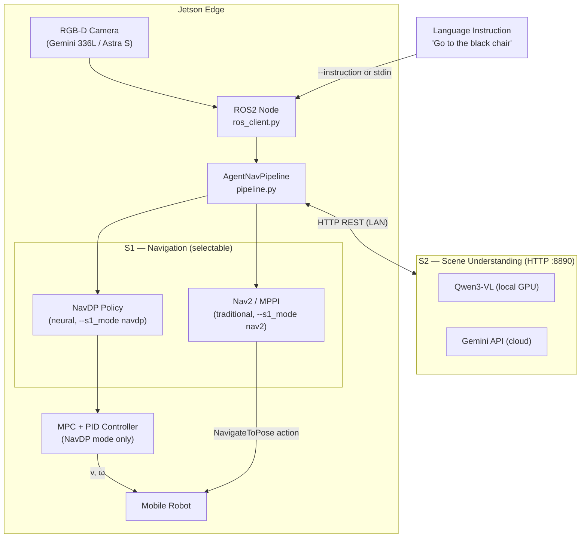
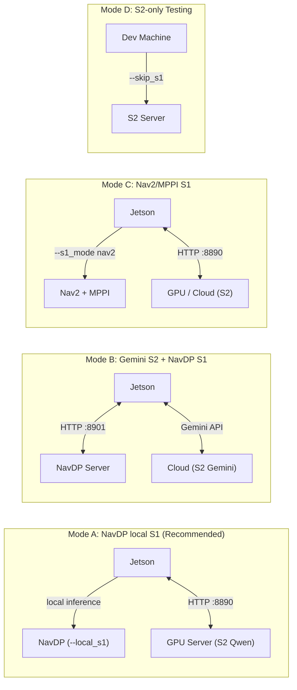

# AgentNav

<p>
  
  
  
  
</p>

**AgentNav** is an open-source framework for language-driven robot navigation. It connects natural language instructions to real robot movement through a dual-system architecture: **S2** handles language-grounded scene understanding via a vision-language model, and **S1** executes low-level navigation — either via the **NavDP** neural policy or a **traditional Nav2/MPPI** planner.

---

## ✨ What We Want To Build

Imagine pointing a robot at a room and saying "go to the black chair by the window" — and having it navigate there, understanding both the language and the scene.

In the short term, we want to establish a practical navigation paradigm: different robots, environments, and instructions should all plug into a unified semantic interface, with the physical navigation handled by swappable low-level policies. The system should work on real hardware at the edge with minimal infrastructure.

In the long term, we want AgentNav to go beyond point-to-point navigation. It should support multi-step instruction following, active scene exploration, and closed-loop recovery when navigation fails. The goal is a navigation stack that reasons about where to go and *why*, not just how to get there.

This paradigm connects:

`Language Instruction → Scene Understanding (S2) → Navigation Policy (S1) → Robot Motion`

The two systems are designed to be independently upgradeable:

- **S2 (Scene Understanding)**: vision-language model that interprets instructions against the camera view and outputs a target pose. Supports local Qwen3-VL or cloud Gemini API.
- **S1 (Navigation Execution)**: executes the target pose. Supports NavDP (neural diffusion policy) or Nav2/MPPI (traditional planner).

---

## 🌱 Current Status

AgentNav is under active development and has been validated on real hardware.

Right now, we are mainly working on:

- end-to-end language-to-navigation on Wheeltec robots with Jetson edge deployment
- comparing neural (NavDP) and traditional (Nav2/MPPI) S1 backends on real indoor scenes
- extending S2 to support multi-step instruction decomposition

The navigation pipeline is functional. We are continuing to improve robustness, expand hardware support, and document the system as we go.

---

## 🏗️ System Architecture



### S1 Navigation Modes

| Mode | Flag | Algorithm | Control output |
|------|------|-----------|----------------|
| NavDP (default) | `--s1_mode navdp` | Neural diffusion policy | Trajectory → MPC/PID → `/cmd_vel` |
| Nav2 / MPPI | `--s1_mode nav2` | Nav2 + MPPI sampling controller | Nav2 action → `/cmd_vel` directly |

### Deployment Modes



---

## 📦 Project Structure

```
AgentNav/
├── agentnav/
│   ├── server/
│   │   ├── s2_server.py               # S2 HTTP server (multi-provider)
│   │   └── providers/
│   │       ├── base_provider.py       # Abstract base class + SYSTEM_PROMPT
│   │       ├── qwen_provider.py       # Local Qwen3-VL inference
│   │       └── gemini_provider.py     # Google Gemini API
│   ├── clients/
│   │   ├── navdp_client.py            # HTTP S1 client (NavDP server)
│   │   ├── navdp_local_client.py      # Local NavDP inference (Jetson edge)
│   │   └── nav2_client.py             # Nav2/MPPI S1 client (traditional nav)
│   ├── core/
│   │   ├── pipeline.py                # S2+S1 orchestration (AgentNavPipeline)
│   │   └── navdp_agent.py             # NavDP_Policy wrapper
│   ├── robot/
│   │   ├── ros_client.py              # Jetson ROS2 node (planning + control)
│   │   └── controllers.py             # MPC + PID controllers (CasADi)
│   └── utils/
│       └── thread_utils.py            # ReadWriteLock
├── tests/
│   └── test_s2_client.py              # S2 standalone test client
├── scripts/
│   ├── start_s2_server.sh
│   └── start_jetson.sh
├── setup.py
├── requirements_server.txt            # GPU server / Gemini provider dependencies
└── requirements_jetson.txt            # Jetson edge dependencies
```

**NavDP dependency**: `navdp_agent.py` loads `NavDP_Policy` from a `NavDP/` directory that is a sibling of `AgentNav/` (from [InternRobotics/NavDP](https://github.com/InternRobotics/NavDP)).
If AgentNav is at `~/VLN/AgentNav`, NavDP should be at `~/VLN/NavDP`. Override with: `NAVDP_ROOT=/path/to/NavDP`.

---

## 🚀 Installation

### S2 Server

#### Option A — Local Qwen3-VL (GPU required)

Reference: [QwenLM/Qwen3-VL](https://github.com/QwenLM/Qwen3-VL)

```bash
conda create -n qwen3vl python=3.10
conda activate qwen3vl

# PyTorch (adjust for your CUDA version)
pip install torch torchvision --index-url https://download.pytorch.org/whl/cu121

# AgentNav S2 dependencies
cd /path/to/AgentNav
pip install -r requirements_server.txt

# Optional: Flash Attention (faster inference)
pip install flash-attn --no-build-isolation

# Download model weights
huggingface-cli download Qwen/Qwen3-VL-8B-Instruct --local-dir /path/to/Qwen3-VL-8B-Instruct
```

#### Option B — Gemini API (no local GPU needed)

```bash
conda activate qwen3vl  # reuse same env, or any Python env with flask

pip install -r requirements_server.txt

# Install one Gemini SDK (new SDK preferred):
pip install google-genai            # new SDK (recommended)
# pip install google-generativeai   # legacy SDK (fallback)

# Get your API key from https://aistudio.google.com/
export GEMINI_API_KEY=your_key_here
```

### S1 Edge — NavDP (Jetson)

Reference: [InternRobotics/NavDP](https://github.com/InternRobotics/NavDP)

```bash
conda create -n navdp python=3.10
conda activate navdp

# Clone NavDP as a sibling of AgentNav
cd ~/VLN
git clone https://github.com/InternRobotics/NavDP

# Jetson-specific PyTorch wheel (aarch64)
pip install /home/wheeltec/torchvision-0.21.0-cp310-cp310-linux_aarch64.whl

cd ~/VLN/NavDP/baselines/navdp
pip install -r requirements.txt

cd ~/VLN/AgentNav
pip install -r requirements_jetson.txt

sudo apt install ros-humble-cv-bridge ros-humble-message-filters
```

### S1 Edge — Nav2/MPPI (Jetson)

Reference: [wheeltec_robot_mppi](../wheeltec_ros2/src/wheeltec_robot_mppi)

```bash
# Nav2 stack + required ROS2 packages
sudo apt install ros-humble-nav2-bringup ros-humble-nav2-msgs \
                 ros-humble-tf2-geometry-msgs ros-humble-slam-toolbox

# Build wheeltec_robot_mppi in your ROS2 workspace
cd ~/ros2_ws
colcon build --packages-select wheeltec_robot_rrt3
source install/setup.bash
```

---

## ▶️ Quick Start

### 1. Start the S2 server

```bash
conda activate qwen3vl

# Local Qwen3-VL (GPU)
python -m agentnav.server.s2_server \
    --provider qwen \
    --model_path /path/to/Qwen3-VL-8B-Instruct \
    --port 8890

# OR: Gemini API (no GPU)
python -m agentnav.server.s2_server \
    --provider gemini \
    --gemini_api_key YOUR_KEY \
    --gemini_model gemini-2.0-flash \
    --port 8890
```

### 2. Test S2 connectivity

```bash
# Random image (connectivity test only)
python tests/test_s2_client.py --host 127.0.0.1 --port 8890 \
    --random --instruction "Go to the chair"

# Real image
python tests/test_s2_client.py --host 127.0.0.1 --port 8890 \
    --image /path/to/test.jpg --instruction "Go to the door"
```

### 3. Pipeline test (S2 only, skip S1)

```bash
python -m agentnav.core.pipeline \
    --s2_host 127.0.0.1 --s2_port 8890 \
    --random --skip_s1 \
    --instruction "Turn left, go to the door"
```

### 4. Full deployment — NavDP S1 (Jetson + local inference)

> **Prerequisites:** Start the robot base and camera drivers first:
>
> ```bash
> # Terminal 1 — robot base (publishes /odom, subscribes /cmd_vel)
> ros2 launch wheeltec_robot base_node.launch.py
>
> # Terminal 2 — RGB-D camera
> ros2 launch orbbec_camera gemini_336l.launch.py
> ```

```bash
conda activate navdp

# Mode A: single instruction via command line
python -m agentnav.robot.ros_client \
    --instruction "Go to the black chair" \
    --s2_host 192.168.1.100 \
    --s1_mode navdp \
    --local_s1 \
    --s1_checkpoint /home/wheeltec/VLN/checkpoints/navdp-cross-modal.ckpt \
    --s1_half

# Mode B: interactive mode (enter instructions one by one at the prompt)
python -m agentnav.robot.ros_client \
    --s2_host 192.168.1.100 \
    --s1_mode navdp \
    --local_s1 \
    --s1_checkpoint /home/wheeltec/VLN/checkpoints/navdp-cross-modal.ckpt \
    --s1_half
# > Go to the black chair
# > Go to the kitchen table
# > q
```

### 5. Full deployment — Nav2/MPPI S1 (Jetson + traditional navigation)

> **Prerequisites:** Start the robot base, camera, and Nav2 stack:
>
> ```bash
> # Terminal 1 — robot base + lidar
> ros2 launch wheeltec_robot base_node.launch.py
>
> # Terminal 2 — RGB-D camera
> ros2 launch orbbec_camera gemini_336l.launch.py
>
> # Terminal 3 — Nav2 + MPPI + SLAM
> ros2 launch wheeltec_robot_rrt3 slam_nav.launch.py
> ```

```bash
conda activate navdp

# Mode A: single instruction
python -m agentnav.robot.ros_client \
    --instruction "Go to the red chair" \
    --s2_host 192.168.1.100 \
    --s1_mode nav2 \
    --map_frame map \
    --camera_frame camera_color_optical_frame

# Mode B: interactive mode
python -m agentnav.robot.ros_client \
    --s2_host 192.168.1.100 \
    --s1_mode nav2 \
    --map_frame map \
    --camera_frame camera_color_optical_frame
# > Go to the red chair
# > Go to the door
# > q
```

Nav2 handles `/cmd_vel` directly via MPPI — the AgentNav control thread yields during navigation.

---

## 📖 Reference

### S2 Providers

| Provider | Flag | Hardware | Notes |
|----------|------|----------|-------|
| Qwen3-VL | `--provider qwen` | GPU (VRAM ≥ 16GB) | Default; best accuracy; runs locally |
| Gemini | `--provider gemini` | None (API) | No GPU needed; requires internet + API key |

**Gemini-specific flags:**

| Flag | Default | Description |
|------|---------|-------------|
| `--gemini_api_key` | `$GEMINI_API_KEY` | Google AI Studio API Key |
| `--gemini_model` | `gemini-2.0-flash` | Model name (`gemini-2.0-flash`, `gemini-1.5-pro`, …) |
| `--gemini_temperature` | `0.0` | Generation temperature (0 = deterministic) |

### S1 Navigation Modes

| Flag | Value | Algorithm | When to use |
|------|-------|-----------|-------------|
| `--s1_mode` | `navdp` (default) | NavDP neural policy | Unstructured environments, learned behaviors |
| `--s1_mode` | `nav2` | Nav2 + MPPI | Mapped environments, predictable spaces |

**Nav2 mode — additional flags:**

| Flag | Default | Description |
|------|---------|-------------|
| `--camera_frame` | `camera_color_optical_frame` | Camera TF frame |
| `--base_frame` | `base_link` | Robot base TF frame |
| `--map_frame` | `map` | Map TF frame |
| `--stop_distance` | `0.5` | Stop distance from target (m) |

**Required TF tree** (wheeltec standard):
```
map → odom_combined → base_footprint → camera_color_optical_frame
```

### Camera Intrinsics

| Camera | Resolution | Constant |
|--------|------------|----------|
| Gemini 336L (default) | 1280×720 | `GEMINI_336L_INTRINSIC` |
| Astra S | 640×480 | `ASTRA_S_INTRINSIC` |

Switch camera (S2 server + Jetson must match):
```bash
python -m agentnav.server.s2_server \
    --image_width 640 --image_height 480 \
    --resize_w 640 --resize_h 480
```

---

## ❓ FAQ

### What is AgentNav?

AgentNav is an open-source framework for language-driven robot navigation. You give it a natural language instruction and a camera feed, and it figures out where to go and drives the robot there. The core focus is navigation — not manipulation, not general embodied AI, but getting a robot from A to B based on what you say and what it sees.

### How does AgentNav differ from running NavDP or Nav2 directly?

NavDP and Nav2 handle the *how* of navigation — trajectory generation and motion planning. AgentNav adds the *what* and *where*: it uses a vision-language model to interpret your instruction against the live camera view and extract a navigation target. Without AgentNav, you need to specify a goal pose manually. With it, you just say "go to the door" and it handles the rest.

### Which S1 backend should I use?

Use **NavDP** for unstructured environments where the robot needs to navigate around furniture, people, and clutter without a pre-built map. Use **Nav2/MPPI** for environments where you have a reliable SLAM map and want predictable, repeatable paths. Both modes accept the same language instructions.

### Can I swap out the vision-language model?

Yes. S2 is a pluggable HTTP server with a provider interface. You can run it with local Qwen3-VL on a GPU server, or with the Gemini API from any machine with internet access. Adding a new provider means implementing `base_provider.py`.

---

## 🗺️ Roadmap

- [x] End-to-end language-to-navigation pipeline on real hardware
- [x] Dual S1 backend: NavDP (neural) and Nav2/MPPI (traditional)
- [x] Dual S2 backend: Qwen3-VL (local) and Gemini (cloud)
- [x] Interactive multi-instruction mode
- [ ] Multi-step instruction decomposition in S2
- [ ] Active exploration when the target is not visible
- [ ] Closed-loop failure detection and recovery
- [ ] Broader robot platform support (beyond Wheeltec)
- [ ] Simulation environment for development and evaluation

---

## 🤝 Contributing

AgentNav is navigation-focused and welcomes contributions in areas that advance that goal:

- new S1 navigation backends (VLN policies, other planners)
- new S2 vision-language providers
- ROS2 integration improvements and new robot platform support
- simulation environments for navigation evaluation
- benchmarking and evaluation tools
- documentation and deployment guides

Contributions welcome via Issues, Pull Requests, and Discussions.

---

## 🙏 Acknowledgements

- [QwenLM/Qwen3-VL](https://github.com/QwenLM/Qwen3-VL) — S2 local visual language model
- [InternRobotics/NavDP](https://github.com/InternRobotics/NavDP) — S1 neural navigation policy
- [Google Gemini API](https://aistudio.google.com/) — S2 cloud visual language model
- [Nav2](https://nav2.ros.org/) — S1 traditional navigation stack (MPPI controller)
