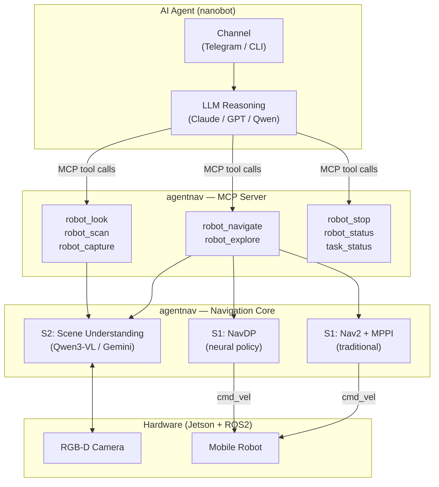

# AgentNav

<p>
  
  
  
  
</p>

**AgentNav** is an open-source framework for agentic robot navigation — let an AI agent drive your robot with natural language.

Instead of issuing a single `navigate("go to chair")` call and hoping for the best, AgentNav exposes navigation as a set of independent tools that an AI agent (via MCP) can reason over: *look*, *navigate*, *scan*, *stop*, *status*. The agent decides when to perceive, when to move, when to retry, and when to give up — just like a human operator would.

```
User: "Go to the black chair"

Agent: robot_look(focus="black chair")
       → "I see a black chair at 2 o'clock, ~2m away"

       robot_navigate("Go to the black chair") → task_id=a1b2

       task_status("a1b2") → {phase: "moving", distance: 0.8m}
       task_status("a1b2") → {phase: "arrived"}

       robot_look() → "I'm standing next to the black chair" ✓
```

---

## Why Agentic Navigation

Traditional navigation stacks are black boxes: one call in, success/failure out. The agent has no visibility into what's happening and no ability to intervene.

AgentNav flips this. Navigation becomes a conversation between the agent and the robot:

| Traditional | AgentNav |
|-------------|----------|
| `navigate(target)` → success/fail | Agent perceives → decides → monitors → recovers |
| Agent blind to progress | Agent polls phase, distance, S2 interpretation |
| Failure = retry blindly | Built-in retry with backoff + agent-level replanning |
| Target must be predefined | Natural language + live camera |

---

## Architecture

```
┌─────────────────────────────────────┐
│  AI Agent (LLM + nanobot / any MCP) │
│  Telegram / Slack / CLI             │
├─────────────────────────────────────┤
│  MCP Tool Layer (agentnav)          │
│  robot_look · robot_navigate        │
│  robot_scan · robot_stop · status   │
├─────────────────────────────────────┤
│  Navigation Core (agentnav)         │
│  S2: Vision-Language Understanding  │  ← Qwen3-VL (local) or Gemini (cloud)
│  S1: Motion Execution               │  ← NavDP (neural) or Nav2/MPPI (traditional)
├─────────────────────────────────────┤
│  Hardware: ROS2 / Jetson            │
│  RGB-D Camera · /cmd_vel · /odom    │
└─────────────────────────────────────┘
```



### S2 — Scene Understanding

| Provider | Hardware | Notes |
|----------|----------|-------|
| Qwen3-VL | GPU (≥16GB VRAM) | Local inference, best accuracy |
| Gemini API | None (cloud) | No GPU needed, internet required |

### S1 — Navigation Execution

| Mode | Algorithm | When to use |
|------|-----------|-------------|
| NavDP (default) | Neural diffusion policy | Unstructured environments, no map needed |
| Nav2 / MPPI | Traditional planner | Mapped environments, predictable paths |

---

## MCP Tool Reference

The agent controls the robot through these tools:

### Navigation Tools

| Tool | Description |
|------|-------------|
| `robot_look(focus?)` | Describe current scene via S2. Pass a focus target to check visibility. |
| `robot_scan(angles?)` | Rotate to multiple angles (default 0/90/180/270°), describe each direction. |
| `robot_capture()` | Return raw camera frame as base64. |
| `robot_navigate(instruction)` | Natural language → S2 pose → S1 execution. Returns `task_id`. |
| `robot_explore(hint?)` | Actively search for a target not currently visible. Returns `task_id`. |
| `robot_stop()` | Emergency stop. Latency < 50ms. |
| `robot_status()` | Current pose, velocity, battery, nav state. |
| `task_status(task_id)` | Poll navigate/explore progress. Status: `running` \| `retrying` \| `completed` \| `failed` \| `cancelled`. Includes `retries` and `last_retry_reason` when applicable. |
| `task_cancel(task_id)` | Cancel task and stop robot. |

### ROS2 Introspection Tools

Let the agent discover any robot's capabilities without hardcoded knowledge:

| Tool | Description |
|------|-------------|
| `ros_list_nodes()` | List all running ROS2 nodes. Start here with any new robot. |
| `ros_list_topics(show_types?)` | List active topics. `show_types=True` includes message types. |
| `ros_topic_info(topic)` | Message type, publisher/subscriber nodes. Warns on motion-control topics. |
| `ros_topic_echo(topic, timeout_s?)` | Read one message from a topic. Returns `{"error":"timeout"}` if none arrives. |
| `ros_service_list()` | List all services with types. |
| `ros_topic_pub(topic, msg_type, data)` | Publish once to a topic. Motion topics always include a safety `warning`. |
| `ros_service_call(service, srv_type, args?)` | Call a ROS2 service and return the response. |

---

## Agent Navigation Patterns

### A — Target visible, navigate directly

```
robot_look(focus="black chair") → visible at 2m
robot_navigate("Go to the black chair") → task_id
[poll task_status every 5s until arrived]
robot_look() → confirm arrival
```

### B — Target not visible, scan then navigate

```
robot_look() → target not visible
robot_scan() → "180°: door leading to corridor"
robot_navigate("Go through the door") → task_id
[arrived] → robot_look(focus="kitchen") → found
robot_navigate("Move to kitchen center") → task_id
```

### C — Transient failure, built-in retry recovers automatically

```
robot_navigate("Go to the black chair") → task_id

task_status(id) → {status: "retrying", retries: 1,
                   last_retry_reason: "S1 connection timeout"}
task_status(id) → {status: "retrying", retries: 2, ...}
task_status(id) → {status: "completed", retries: 2} ✓
```

If retries are exhausted, the agent replans:

```
task_status(id) → {status: "failed", error: "S2 could not locate target"}
robot_look() → "chair partially behind table, only leg visible"
robot_navigate("Go to the chair leg visible behind the table") → task_id
[arrived] ✓
```

### D — Emergency stop

```
User: "stop"
Agent: robot_stop() → "Robot stopped."
```

### E — First contact with an unknown robot

```
Agent: ros_list_nodes()
       → {nodes: ['/base_controller', '/lidar', '/camera_node'], count: 3}

       ros_list_topics(show_types=True)
       → {topics: [{name: '/cmd_vel', type: 'geometry_msgs/msg/Twist'},
                   {name: '/odom',    type: 'nav_msgs/msg/Odometry'},
                   {name: '/scan',    type: 'sensor_msgs/msg/LaserScan'}, ...]}

       ros_topic_echo('/odom', timeout_s=3)
       → {message: {pose: {pose: {position: {x: 1.2, y: 0.8}}}, ...}}

       ros_topic_info('/cmd_vel')
       → {publisher_count: 0, subscriber_count: 1,
          warning: '/cmd_vel is a motion-control topic...'}

       → Agent now knows the robot's interface and can proceed with navigation
```

---

## Driver System

AgentNav's MCP tools are implemented as **hot-reloadable drivers** in `agentnav/drivers/`. Drop a new `*.py` file in that directory and send `/restart bridge` — no conversation history is lost.

### Driver Metadata

Each driver exports a `DRIVER_META` dict that makes LLM routing more precise:

```python
# agentnav/drivers/stop.py
DRIVER_META = {
    "triggers":      ["stop", "halt", "emergency stop", "freeze", "abort"],
    "safety_level":  "danger",   # "safe" | "caution" | "danger"
    "phase":         1,          # 1 | 2 | 3
    "description":   "Emergency stop: sets stop flag and cancels all running tasks.",
}
```

The bridge server validates this at load time and appends it to each tool's MCP description:

```
[safety:danger | phase:1 | triggers: stop, halt, emergency stop, freeze, abort]
```

This suffix is visible to the LLM, so it can route naturally-worded user messages ("freeze the robot!") to the right tool without hallucinating.

### Built-in Retry Strategy

`TaskManager` provides configurable retry with backoff and jitter — inspired by ClawSkill's
mechanical-arm retry pattern (random offset on pickup failure):

```python
# Defaults — configurable per TaskManager instance
TaskManager(
    state,
    max_retries   = 3,
    retry_delay_s = 2.0,
    backoff       = "fixed",   # "fixed" | "exponential"
    jitter_s      = 0.0,       # adds random uniform delay to avoid thundering-herd
)
```

Pass a **factory** (callable) to get retries; a bare coroutine runs once only:

```python
# Retries on transient failure — recommended
task_id = task_mgr.start(lambda: s1_client.navigate_to(pose), instruction="go to chair")

# One-shot (no retries) — for backwards compatibility
task_id = task_mgr.start(some_coroutine(), instruction="go to chair")
```

`CancelledError` is never retried — `robot_stop()` always wins regardless of retry state.

---

## Project Structure

```
AgentNav/
├── nanobot/                 ← Agent OS (MCP client, Telegram/Slack/CLI channels)
│   ├── agent/               ← LLM loop, memory, skills, subagents
│   ├── channels/            ← Telegram, Slack, Discord, WeChat, Email ...
│   ├── providers/           ← LiteLLM, Azure OpenAI, Codex ...
│   └── tools/               ← filesystem, shell, web, MCP, cron
│
└── agentnav/                ← Navigation core + MCP server (Python 3.10, runs on Jetson)
    ├── bridge_core/         ← MCP server entry, RobotState, TaskManager, driver loader
    │   ├── server.py        ← FastMCP stdio server, hot-loads drivers/
    │   ├── robot_state.py   ← Thread-safe state machine (IDLE→MOVING→ARRIVED/FAILED)
    │   ├── task_manager.py  ← Async task lifecycle with retry/backoff
    │   └── driver_meta.py   ← DRIVER_META schema validation and LLM description injection
    ├── drivers/             ← Hot-reloadable MCP tool implementations
    │   ├── stop.py          ← robot_stop (safety:danger)
    │   ├── status.py        ← robot_status (safety:safe)
    │   └── ros_introspect.py← ros_list_nodes/topics/services/echo/pub/call (safety:caution)
    ├── core/                ← S2 and ROS2 client stubs (Phase 2+)
    │   ├── s2_client.py     ← HTTP client for Qwen3-VL / Gemini
    │   └── ros_client.py    ← ROS2 subscriber, odometry, camera frames
    ├── skills/              ← Claude Code skills for development
    └── config/              ← nanobot integration config
```

---

## Quick Start

### 1. Install nanobot (agent OS)

```bash
pip install nanobot-ai          # Python 3.11+
```

### 2. Set environment variables

```bash
export ANTHROPIC_API_KEY=sk-ant-...          # Anthropic API key
export TELEGRAM_BOT_TOKEN=123456:ABC-...     # from @BotFather
export MY_TELEGRAM_ID=987654321              # your numeric ID (from @userinfobot)
export NAVDP_PYTHON=/opt/conda/envs/navdp/bin/python   # Python 3.10 in navdp env

# Optional (have defaults)
export S2_HOST=127.0.0.1
export S2_PORT=8890
export S1_MODE=navdp
```

### 3. Launch (installs agentnav + writes config + starts gateway)

```bash
bash agentnav/scripts/start_robot_agent.sh
```

This script:
1. Installs `agentnav` into your navdp Python env (editable)
2. Writes `~/.nanobot/config.json` with your env vars substituted
3. Runs `nanobot gateway` — nanobot launches the MCP server as a subprocess automatically

### 4. Talk to your robot via Telegram

```
You: stop
Bot: Robot stopped. Emergency stop flag set.

You: Where is the robot and what is its status
Bot: {
       "nav_state": "idle",
       "pose": {"x": 1.2, "y": 0.8, "theta": 0.3},
       "battery_pct": 82,
       "velocity": {"v": 0.0, "w": 0.0}
     }
```

Tools available now: `robot_stop`, `robot_status`, and all 7 `ros_*` introspection tools.
Phase 2+ tools (after wiring ROS2 subscribers): `robot_look`, `robot_scan`, `s2_locate`, `s1_move`, `task_status`.

---

## Installation

### S2 Server

```bash
conda create -n qwen3vl python=3.10
conda activate qwen3vl
pip install -r requirements_server.txt

# Optional: Flash Attention (faster)
pip install flash-attn --no-build-isolation

# Download Qwen3-VL weights
huggingface-cli download Qwen/Qwen3-VL-8B-Instruct --local-dir /path/to/weights
```

### Jetson Edge (NavDP)

```bash
conda create -n navdp python=3.10
conda activate navdp

# Clone NavDP as sibling of AgentNav
git clone https://github.com/InternRobotics/NavDP ../NavDP
pip install -r requirements_jetson.txt
pip install -e .

sudo apt install ros-humble-cv-bridge ros-humble-message-filters
```

### Jetson Edge (Nav2/MPPI)

```bash
sudo apt install ros-humble-nav2-bringup ros-humble-nav2-msgs \
                 ros-humble-tf2-geometry-msgs ros-humble-slam-toolbox
```

---

## Roadmap

- [x] End-to-end language-to-navigation on real hardware
- [x] NavDP (neural) and Nav2/MPPI (traditional) S1 backends
- [x] Qwen3-VL (local) and Gemini (cloud) S2 backends
- [x] MCP tool layer for agentic control
- [x] nanobot agent OS integration (Telegram / CLI)
- [x] ROS2 introspection tools — agent discovers any robot's nodes/topics/services dynamically
- [x] Driver metadata system — trigger-based LLM routing, safety levels, phase tagging
- [x] Built-in retry/backoff in TaskManager — fixed/exponential + jitter, CancelledError-safe
- [ ] `robot_look` / `robot_scan` perception tools (Phase 2)
- [ ] `s2_locate` + `s1_move` locate-and-move pipeline (Phase 3)
- [ ] `robot_explore` active target search
- [ ] Closed-loop failure recovery (agent replans on task_status failed)
- [ ] Progress streaming to Telegram during navigation
- [ ] Simulation environment for development and evaluation
- [ ] Broader robot platform support

---

## Acknowledgements

- [QwenLM/Qwen3-VL](https://github.com/QwenLM/Qwen3-VL) — S2 vision-language model
- [InternRobotics/NavDP](https://github.com/InternRobotics/NavDP) — S1 neural navigation policy
- [Google Gemini API](https://aistudio.google.com/) — S2 cloud provider
- [Nav2](https://nav2.ros.org/) — S1 traditional navigation stack
- [SenseRobotClaw/ClawSkill](https://github.com/SenseRobotClaw/ClawSkill) — inspiration for driver metadata and retry patterns

---

## Contributing

Contributions welcome in:

- New S1 navigation backends (VLN policies, other planners)
- New S2 vision-language providers
- ROS2 integration and new robot platforms
- Simulation environments
- Benchmarking and evaluation tools

Issues, PRs, and Discussions are open.
