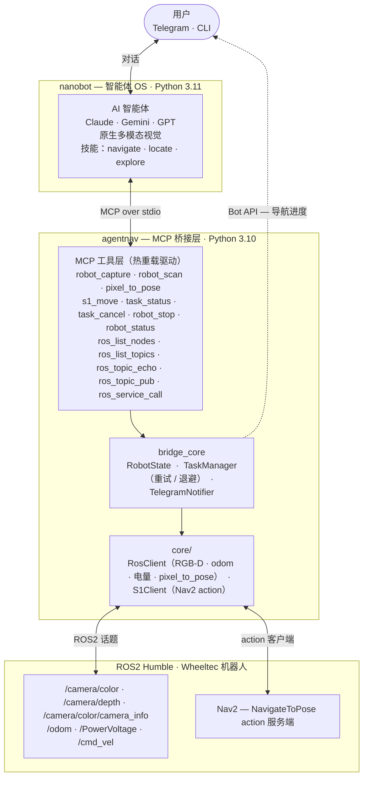

# 🤖 AgentNav：智能体机器人导航框架

<p align="center">
  <a href="README.md">English</a> | <strong>中文</strong>
</p>

<p align="center">
  
  
  
  
  
</p>

<p align="center">
  <strong>"告别硬编码，开启对话式导航。"</strong><br>
  AgentNav 是一个面向智能体机器人导航的开源框架 —— 让多模态 AI 智能体（Claude、Gemini、GPT）通过自然语言和原生视觉直接驱动你的机器人。
</p>

<p align="center">
  <!-- 可替换为实际的演示 GIF 或视频 -->
  
</p>

---

## 📖 目录

- [💡 为什么选择智能体导航？](#-为什么选择智能体导航)
- [🚀 核心特性](#-核心特性)
- [🏗️ 架构设计](#️-架构设计)
- [🧠 定义技能（"大脑"）](#-定义技能大脑)
- [🔧 MCP 工具参考（部分）](#-mcp-工具参考部分)
- [🛠️ 快速开始](#️-快速开始)
- [🗺️ 项目状态与路线图](#️-项目状态与路线图)
- [🤝 参与贡献](#-参与贡献)
- [📜 许可证](#-许可证)

---

## 💡 为什么选择智能体导航？

传统导航栈是一个"黑盒"：给一个目标点进去，得到成功/失败的结果出来。智能体无从得知**为什么**移动失败，也无法知道**如何**恢复。

**AgentNav 彻底颠覆了这种模式。** 导航变成了 AI "大脑"与机器人"肢体"之间的透明对话：

| 特性 | 传统导航 | 🤖 AgentNav |
|:---|:---|:---|
| **感知** | 需要预先定义目标坐标 | **自然语言** + 实时摄像头画面 |
| **可见性** | 智能体对进度一无所知 | 智能体**主动查询阶段、距离和状态** |
| **逻辑** | 硬编码的 C++/Python 管线 | **基于 Markdown 的技能**（教出来，而非写出来） |
| **视觉** | 需额外的 VLM/目标检测模块 | **原生多模态**（智能体直接看像素） |
| **错误恢复** | 盲目重试或直接放弃 | 智能体失败时**重新估计并再次规划** |

---

## 🚀 核心特性

- **👀 原生多模态视觉：** 智能体通过 `robot_capture()`（MCP ImageContent）直接感知场景。无需任何中间的目标检测器。
- **🛠️ 零样本发现能力：** 借助 `ros_list_*` 系列工具，智能体可以动态探索并理解任何新机器人的节点、话题和服务。
- **🔄 热重载驱动：** 无需中断对话历史，即可即时添加或更新 MCP 工具（Python 驱动）。
- **🧠 基于技能的智能：** 复杂行为（搜索 → 定位 → 移动）通过 Markdown 文件教授，更新机器人"逻辑"就像改提示词一样简单。
- **🛡️ 安全优先：** 内建 `robot_stop()`，延迟低于 50ms，所有工具都带有安全等级标签。

---

## 🏗️ 架构设计



---

## 🧠 定义技能（"大脑"）

AgentNav 使用 **Skills（技能）** —— 即指导 LLM 如何使用工具的 Markdown 文件。这使得构建复杂工作流无需编写脆弱的硬编码逻辑。

**示例：`skills/locate.md`**
> "要定位一个物体：
> 1. 使用 `robot_capture()` 查看场景。
> 2. 如果找到目标，估计其像素坐标 (u, v)。
> 3. 调用 `pixel_to_pose(u, v)` 获取机器人坐标系下的坐标。
> 4. 如果未找到，使用 `robot_scan()` 执行 360° 环视。"

---

## 🔧 MCP 工具参考（部分）

### 📸 感知与运动
| 工具 | 描述 | 安全等级 |
|:---|:---|:---|
| `robot_capture()` | 以 **ImageContent** 形式返回实时画面。 | ✅ 安全 |
| `pixel_to_pose(u, v)` | 基于深度数据将像素转换为 `{x, y, theta}`。 | ✅ 安全 |
| `s1_move(pose)` | 通过 Nav2 发起非阻塞移动，返回 `task_id`。 | ⚠️ 谨慎 |
| `robot_stop()` | **紧急停止。** 立即取消所有任务。 | 🚨 危险 |

### 🔍 ROS2 内省
让智能体能够"学习"当前机器人的具体配置：
- `ros_list_nodes()` / `ros_list_topics()`
- `ros_topic_echo()` / `ros_service_call()`

---

## 🛠️ 快速开始

### 1. 安装 nanobot
```bash
pip install nanobot-ai          # Python 3.11+
```

### 2. 配置环境
创建 `.env` 文件（或使用 export 导出变量）：
```bash
export ANTHROPIC_API_KEY=sk-ant-...
export TELEGRAM_BOT_TOKEN=123456:ABC-...
# 完整的 TOPIC_ 覆盖项列表请参见 README
```

### 3. 启动
```bash
bash agentnav/scripts/start_robot_agent.sh
```

---

## 🗺️ 项目状态与路线图

- [x] **阶段 1：** MCP 核心 & 驱动热重载
- [x] **阶段 2：** 原生视觉（`robot_capture`）& ROS2 内省
- [x] **阶段 3：** Nav2 集成 & 坐标转换（`pixel_to_pose`）
- [ ] **阶段 4（进行中）：** 闭环失败恢复 & 技能优化
- [ ] **未来计划：** 仿真支持（Gazebo / Isaac Sim）🏗️ *招募贡献者*
- [ ] **未来计划：** 多机器人协同 🤖🤖

---

## 🤝 参与贡献

我们欢迎各种形式的贡献！无论是为新传感器编写 **Driver（驱动）**、为复杂任务定义新的 **Skill（技能）**，还是适配新的**机器人平台**。

1. Fork 本仓库
2. 创建你的功能分支
3. 提交 PR

---

## 📜 许可证
MIT License。详情请见 [LICENSE](LICENSE)。

---
<p align="center">用 ❤️ 为机器人与 AI 社区打造。</p>
